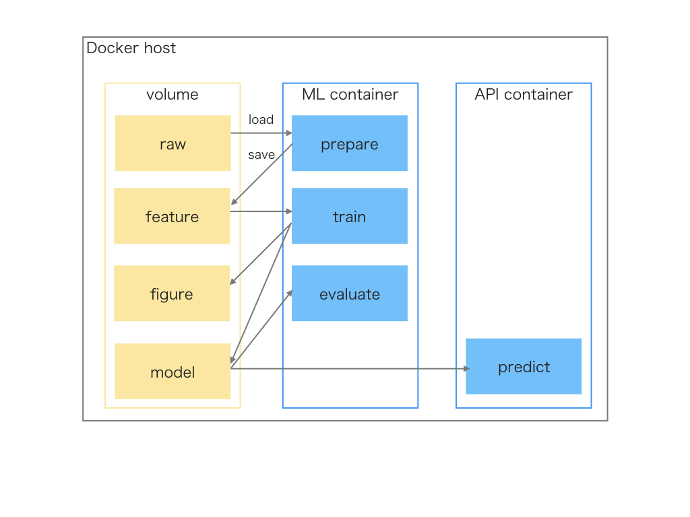

# Sample code for machine learning container
## Overview
- This repository is sample code for a machine learning container.
- Train and evaluate using LightGBM or TensorFlow.
- The [OnlineNewsPopularity](https://archive.ics.uci.edu/ml/datasets/Online+News+Popularity) dataset is used.



## Setup
You need to prepare [docker](https://www.docker.com/) environment.

## Usage
[Kaggle Python docker image](https://console.cloud.google.com/gcr/images/kaggle-images/GLOBAL/python?gcrImageListsize=30) (16 GB image size) is used.

### Quikstart
#### Remove container
```
$ inv remove
```

#### Run container
```
$ inv run
```

#### Step 1: Prepare
```
$ inv prepare
```

#### Step 2: Train
```
$ inv train
```

#### Step 3: Evaluate
```
$ inv evaluate
```

### Test
```
$ pytest
```

## Module design
| Module   	| Description					| Input 	            | Output           	            |
|----------	|----------------------------	|-------------------	|----------------------------	|
| Prepare  	| Get dataset and transforme 	| Data file (*.csv) 	| Feature file (*.pkl)          |
| Train    	| Train the model 				| Feature file (*.pkl) 	| Model file (*.pkl)   	        |
| 			| 					        	| 						| Importance plot file (*.png)  |
|			|								|						| Loss plot file (*.png)		|
| Evaluate  | Evaluate the Model 			| Model file (*.pkl) 	|        						|
|          	|								| Feature file (*.pkl) 	| 								|


## Folder tree
```
.
├── Dockerfile
├── README.md
├── docker-compose.yml
├── invoke.yml
├── project
│   ├── _config.yml
│   ├── data
│   │   ├── pickle
│   │   │   ├── X_test.pkl
│   │   │   ├── X_train.pkl
│   │   │   ├── Y_test.pkl
│   │   │   └── Y_train.pkl
│   │   └── raw
│   │       ├── OnlineNewsPopularity
│   │       │   ├── OnlineNewsPopularity.csv
│   │       │   └── OnlineNewsPopularity.names
│   │       └── OnlineNewsPopularity.zip
│   ├── figure
│   │   ├── lbg_loss.png
│   │   ├── lgb_importance.png
│   ├── logs
│   │   ├── evaluate.py.log
│   │   ├── prepare.py.log
│   │   └── train.py.log
│   ├── models
│   │   └── lgb.pkl
│   ├── notebook
│   │   ├── lgb.ipynb
│   │   └── nn_3layer.ipynb
│   └── source
│       ├── __init__.py
│       ├── config.py
│       ├── evaluate.py
│       ├── hello.py
│       ├── prepare.py
│       └── train.py
├── tasks.py
└── tests
```